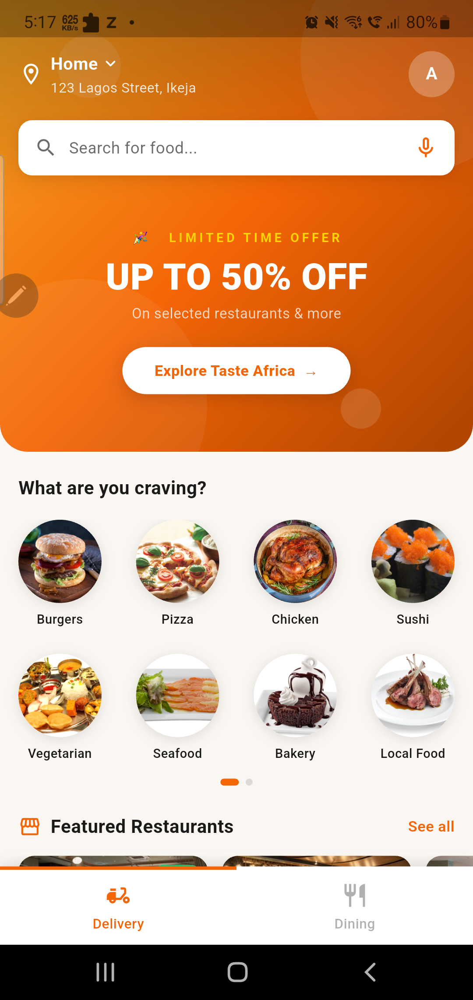
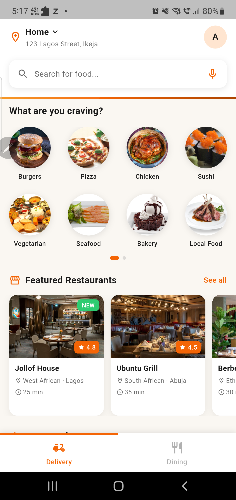

# Taste Africa

A Flutter food delivery app that celebrates African cuisine, connecting users with top-rated African restaurants across the continent.

## Demo

▶️ [Watch Demo Video](https://drive.google.com/file/d/17XJiGm6ik9DMnsUPEgFE2Zpw149hRgV9/view?usp=sharing)

## Features

- **Delivery & Dining modes** — switch between food delivery and dine-in experiences via the bottom navigation bar
- **Food categories** — browse African cuisine categories at a glance
- **Featured restaurants** — curated selection of top African restaurants (West African, Ethiopian, South African, Pan African, Seafood)
- **Top-rated restaurants** — sorted by user ratings
- **Offer banners** — dynamic promotional banners on the home screen
- **Location-aware header** — shows the user's delivery address

## Screenshots

| Screenshot 1 | Screenshot 2 |
|---|---|
|  |  |

## Tech Stack

- **Flutter** 3.x / **Dart** 3.x
- Clean Architecture (feature-based folder structure: data / domain / presentation)
- Material 3 theming

## Project Structure

```
lib/
├── app/               # App entry, shared widgets (nav bar, search bar, banners)
├── core/              # Theme, colors, constants
└── features/
    ├── home/          # Home feature (entities, data, presentation)
    ├── delivery/      # Delivery page
    └── dining/        # Dining page
```

## Getting Started

### Prerequisites

- Flutter SDK ≥ 3.11.5
- Dart SDK ≥ 3.x

### Run

```bash
flutter pub get
flutter run
```
